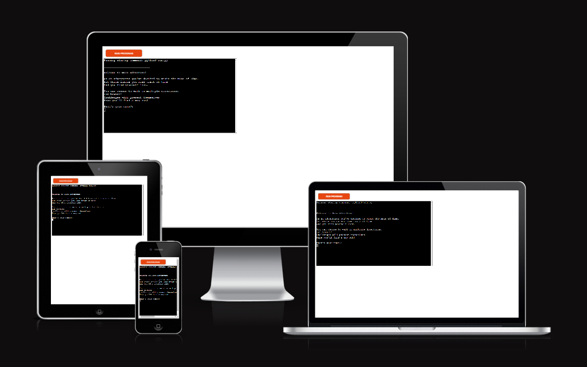
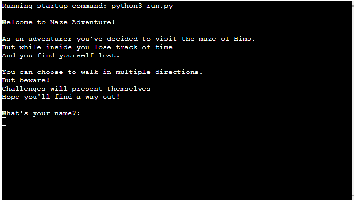
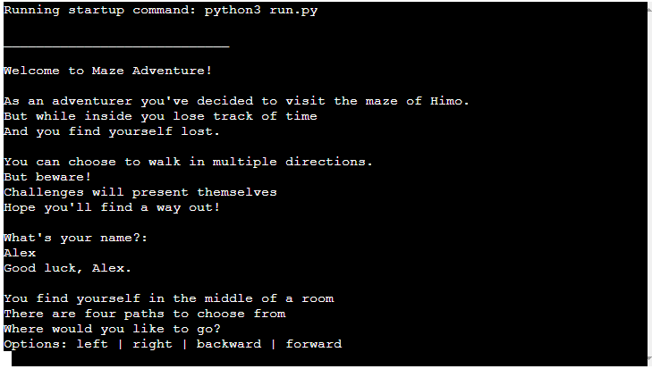
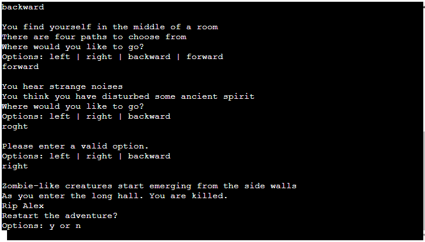
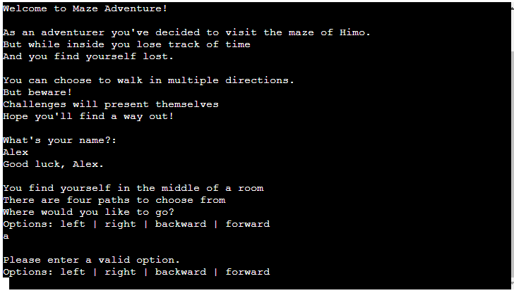

# Maze Adventure
**The Maze Adventure!** is a python terminal game, the user can emerse themselves in this textbased short story and try to find a way out of the maze, but beware, something may be lurking around the corner.

[Live Site - Maze Adventure](https://mazeadventure.herokuapp.com/)

## How to play
The player has the ability to choose what actions they want to take in every scene, they have the options to move in different directions and to flee or fight. don't forget to take a look around, you may find a hidden weapon if you go where you shouldnt.

## Features
### Existing Features

**Welcome Message**
- Welcomes the player and sets the scenery of the story.
- Asks for the players name.

**Options!**
- Presents the player with up to four options.

**Restart Game!**
- Promts the player to restart the game and play again if the win or die.

**Invalid Option!**
- Tells the player that the option they've chosen was invalid.

### Future Features
- Expanding the storyline
- Placing more weapons around the game
- Using riddles to escape rooms

## Testing
I have manually tested the project by:
- Giving invalid inputs
- Tested with my local terminal and the Code Institute terminal

## Bugs
### Solved bugs
- In the beginning when I wrote the code and ran the progrem, the terminal got spammed with print messages, I relized I missed using a "Else statement" in the "While loop".

### Reamining bugs
- No known bugs!

Validator

Deployment

## Credits
- Deployment Terminal - Code Institute