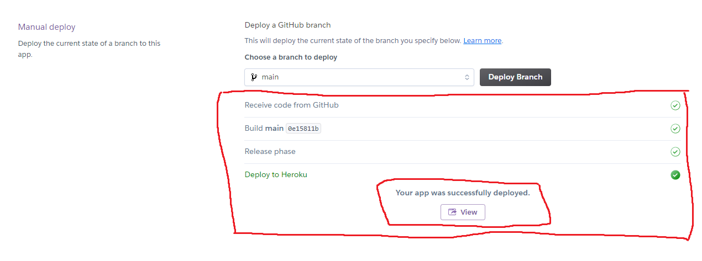

# Maze Adventure
**The Maze Adventure!** is a python terminal game, the user can immerse themselves in this text-based short story and try to find a way out of the maze, but beware, something may be lurking around the corner.

[Live Site - Maze Adventure](https://mazeadventure.herokuapp.com/)

[Repository - Maze Adventure](https://github.com/Madebybrown/MazeAdventure.com)

## How to play
The player can choose what actions they want to take in every scene, they have the options to move in different directions and to flee or fight.
Keep your eyes open, you may find a hidden object LEFT behind if you go where you shouldn't.

## Features
### Existing Features

**Welcome Message**
- Welcomes the player and sets the scenery of the story.
- Asks for the players' names.

**Options!**
- Presents the player with up to four options.

**Restart the Game!**
- Prompts the player to restart the game and play again if they win or die.

**Invalid Option!**
- Tells the player that the option they've chosen was invalid.

**Numbers Game!**
- A game of guessing the right random number between 1 and 10.

- When your guess is too low

- When your guess is too high

### Future Features
- Expanding the storyline
- Placing more weapons and monsters around the game
- Using mini-games to escape situations
- Adding RPG features

## Testing
I have manually tested the project by:
- Giving invalid inputs
- Tested with my local terminal and the Code Institute terminal
- Letting other people play the game with the intention of "brake" it

## Bugs
### Solved bugs
- In the beginning, when I wrote the code and ran the program, the terminal got spammed with print messages, I realized I missed using an "Else statement" in the "While loop".

### Remaining bugs
- No known bugs!

## Validator
I used a free service called [Extendsclass.Com](https://extendsclass.com/python-tester.html) to validate my code without any known issues.

I also used [Pythonchecker.com](https://www.pythonchecker.com/) to validate my code.

I also used [Infoheap.com](https://infoheap.com/python-lint-online/) to validate my code.

## Deployment
The project was deployed using Heroku.
 - Steps for deployment:
    - First, when on the Heroku dashboard, click new up to your right-hand side, this will toggle a drop down.

    - Click on "Create new app", this will take you to a new page.

    - Here you choose your app name, and your region, and then you click "Create app" down to the left-hand side, this will take you to a new page.

    - On this page, you first click on the settings tab.

    - Here you scroll down until you see the button with "Reveal Config Vars" on it, click it!

    - Write PORT and 8000 and then press "Add". 

    - Scroll down to Buildpacks, and click it.

    - Click python to check it and then save changes, and click add buildpack again.

    - Now scroll up to the top of the page and press the "Deploy" tab and then press GitHub.

    - Search for the repository you want to deploy.

    - Press connect.

    - Scroll down until you find "Enable Automatic Deploys" and "Deploy Branch", press them, and wait while your app is building.

    - Building app

    - App build is finished

## Credits
- Deployment Terminal - Code Institute